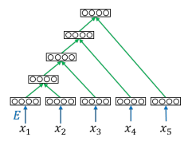
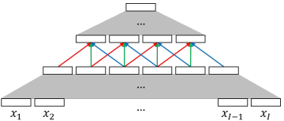

# Word Embedding

將 word 表達成 continuous vectors 是 NLP 的精隨之一

* Key Idea
  * 將一個存在字典 () 的單字 (`x`) 表達成 `d` 維度的向量
    * `d` 通常遠小於 
  * 儲存形式為 embedding matrix 
    * `E` 的第 `x` column 代表 word `x` 的 `d` 維向量

透過 embedding 可以抓到文字之間的相似度 (morphological, syntactic, semantic)

* embedding 通常跟著神經網路同時訓練 (back-propagation)
* 在訓練 embedding 時會將頻繁字的上下文 context 納入訓練重點
* Cross-lingual 的資訊可以提升 embedding 能力
  * `Exploiting similarities among languages for machine translation`
  * `Cross-lingual models of word embeddings: An empirical comparison`
* pre-trained embedding 幾乎在任何 NLP 任務都會採用

新出現的種類叫做 contextualized word embeddings

* 不只考慮文字，而是考慮整個 input sequence
* 不能用單個 embedding matrix `E` 來表達，而是一個 neural sequence model
* 通常使用 LSTM, Transformer 來訓練
  * `Deep contextualized word representations`
  * `BERT: Pre-training of deep bidirectional Transformers for language understanding`
  * `Looking for ELMo’s friends: Sentence-level pretraining beyond language modeling`
* 被證實對 syntax 較為敏銳
  * `Assessing BERT’s syntactic abilities`

# Phrase Embedding

在情感分析或是機器翻譯 (MT) 特別需要將整個片語或句子變成 embedding

* source phrase `x` 就可以作為 target phrase `y` 的條件 
* 做法是使用 `recurrent autoencoder`
  * `Recursive distributed representations`
  * `Semi-supervised recursive Autoencoders for predicting sentiment distributions`
    1. 首先先訓練出一般的 embedding 
    2. 接著從 `E` 重複提取 2 維的向量到 autoencoder network
    3. 然後從 autoencoder 得到 1 維的向量
    4. 重複 2-3 得到整個片語的 embedding

這裡有一個使用 recurrent autoencoder 把五字片語合成為一個 4 維向量的圖例: 

* Recurrent autoencoder 缺點是 word, phrase 必須要是相同維度向量
  * 在情感分析不是大問題
  * 但在翻譯是個問題，因為必須要傳送夠多的資訊給 target sentences，所以 phrase 維度應比 word 更高

# Sentence Embedding

`N. Kalchbrenner, P. Blunsom, Recurrent continuous translation models` 使用 CNN 來取代 recurrent autoencoder 讓 word, sentence 不需要相同維度

* 在每個 convolutional layer 會產生一個 `n-gram` representation
* n 會隨著層數增加，最後一層就可以表達整個句子
* 缺點是 convolution 會喪失整個句子 order 的資訊

新方法是使用 self-attention

1. `DiSAN: Directional self-attention network for RNN/CNN-free language understanding`
2. `Phrase-level self-attention networks for universal sentence encoding`
3. `Variational self-attention model for sentence representation`

另一個方法是用 recursive relation networks，反覆抓出句子中任兩個字的關係

1. `Sentence encoding with tree-constrained relation networks`
2. `A simple neural network module for relational reasoning`
3. `Recurrent relational networks`

