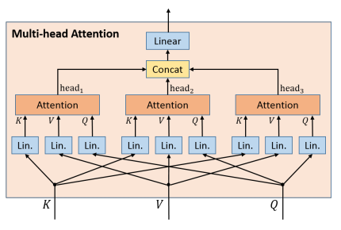

# Attention

單純的 encoder-decoder model 在產生長句子的翻譯時效果很爛，原因來自 `fixed-length source sentence encoding`

* 固定長度的 source encoding 不能給 decoder 足夠資訊來翻譯
* 一開始有人把句子差成多個子句，翻譯後再合併，但效果不好
  * `Overcoming the curse of sentence length for neural machine translation using automatic segmentation`
* 另一個想法是 attention 不再使用固定長度的 encoding ()
  * Attentional decoder 可以只看需要的 encoder 資訊來翻譯
  *  變成一系列的  其中 j 代表時間點

## Intuitive

Attention 的概念就像: 

* Input: n `query vectors`
* Mapping: Mapping Table (m `key-value pairs`)
* Output: n `output vectors`

每個 vector 都是 d 維，然後可以堆疊起來，所以有三大矩陣: 

* 
* 
* 

直覺上，每個 `query vector` 在算出 `output vector` 前會先變成 `value vector` 的權重，這個權重由 query 跟所有 keys 計算 `similarity score` 得到

* 

* `score(Q, K)` 是一個 similarity score matrix (n, m)
* 會使用 softmax 將每個 column 都一般化，代表每個 `query vector` 的權重加總為一
* `score()` 有最常使用的計算方式是 dot product

## Method

* Decoder hidden state () 是 `query vectors`
* Encoder hidden state () 是 `key, value vectors`

如此一來:

*  為 `query vectors`
  *  為 target sentence length
*  為 `key, value vectors`
  *  為 source sentence length

Attention layer 產出來的 output 為 `time-dependent context vectors` ()

* 每個時間點 j 我們會 query 原句子一次
* 然後最終能得出一個 `attention matrix` ()
* 從 A 可以看出翻譯句子和原句子之間的關係

## Multi-head Attention

> * Attention is all you need

Multi-head attention 是由 `H` (通常為 8) 個 attention 組合而成

* 一個 attention head 的 `query, key, value vectors` 都是 Q, K, V 的 linear transforms
* Multi-head attention 的輸出就是這 H 個 attention heads 的 concatenation
* Attention heads 的維度通常會除以 H 避免參數過多

* 其中的 weight matrix 是 
* 每個 head 是 
  *  都是權重，由網路訓練

Multi-head attention 雖然效能較好，但無法像 attention 輕鬆產出 attention matrix，所以較難解釋

# Attention Masks and Padding

通常我們會將句子裝成 batches 加快訓練速度、減少 gradient 的 noise

而格式為 tensor 的句子，因為需要固定長度，所以在較短句子的後面會加入 `<pad>` 來補足

為了不讓 `<pad>` 被納入 attention 的計算，所以會加入 mask 的系統

* 紅色的 `<pad>` 的 mask 都會是 0
* 綠色的單字的 mask 都會是 1

計算中的 attention weight 就會乘上 mask 來忽略 `<pad>`

# Recurrent Neural Machine Translation

# 補充

https://zhuanlan.zhihu.com/p/47063917
* RNN 和 Attention 的結合

https://zhuanlan.zhihu.com/p/47282410
* Self-attention 捨棄 RNN 只留 attention
  * 每個字和其他字的關係產生 attention score
  * 在 encoder 會層層疊加 self-attention
  * 在 decoder 不僅看前一個輸出字，也會看 encoder 的
  * self-attention 由 QKV 組成算出 Z (https://www.zhihu.com/question/325839123)
    * Query = 自己
    * Key = 所有字
    * Value = 該 key 的價值 (通常 k=v)
    * WQ, WK, WV 就是要訓練的參數
* Multi-head attention 只是很多個 self-attention 結合而已
  * 也就是可以有多組 QKV
  * 每個 self-attention 關注的點可能不同
  * 最後還是會組成一個 Z
* Mask multi-head attention
  * 放在第一層，輸入來自前一層的 decoder
  * Mask 讓我們只能 attend 翻譯過的 encoder
  * 在預測第 t 個詞的時候要把 t+1 到末尾的詞遮住，只對前面 t 個詞做 self-attention
* Encoder-Decoder attention layer
  * Q 來自前一個 decoder 輸出
  * KV 來自 encoder 輸出
  * 讓每個位置的 decoder 都能對到 input 的每個位置
* Position encoding
  * 因為沒有 CNN 或 RNN 無法知道字的位置
  * 所以加一個 encoding 在 embedding 上，知道字的位置
* Add & Norm
  * Residual connection
  * Layer normalization

https://zhuanlan.zhihu.com/p/47613793
* Universal Transformers
  * 加入 transition function 來循環 attention
* BERT
  * 雙向 transformer
* Generating Wikipedia by Summarizing Long Sequences
  * 讀很多文章，自動生出 wiki 風格的內容
* Show, Attend and Tell
  * 影像處理 (caption) 才是 attention 最早使用的地方
* Image Transformer
  * 用 attention 圖像合成，還原解析度