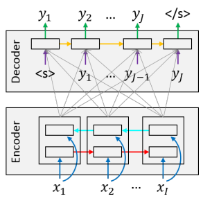
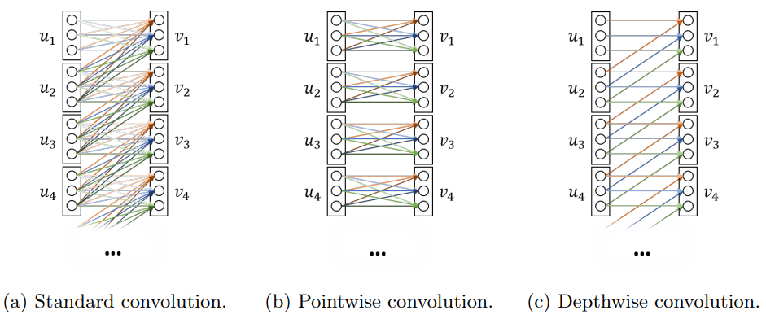
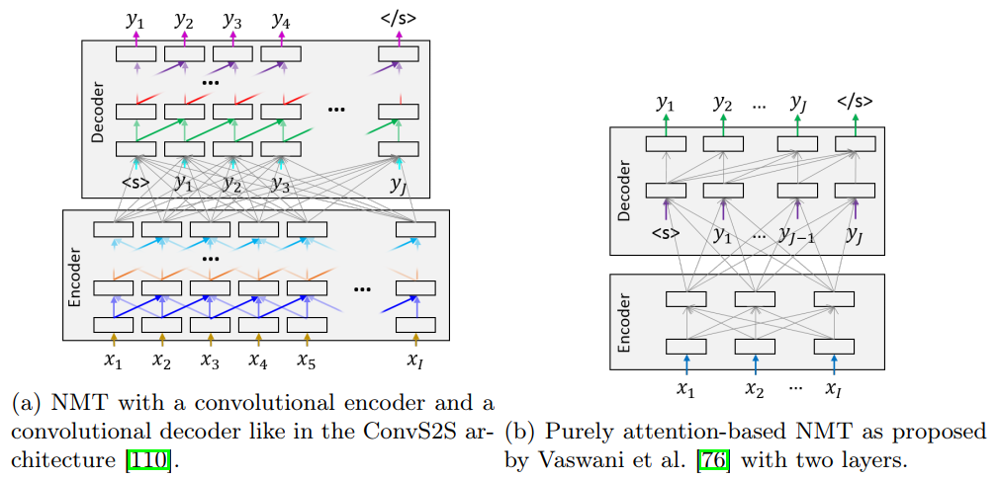
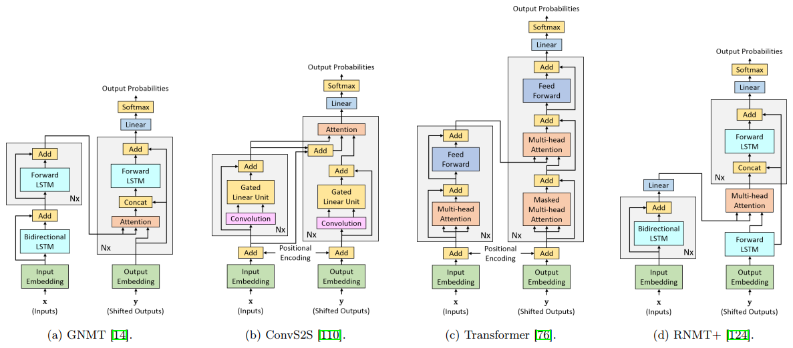

# Attention

單純的 encoder-decoder model 在產生長句子的翻譯時效果很爛，原因來自 `fixed-length source sentence encoding`

* 固定長度的 source encoding 不能給 decoder 足夠資訊來翻譯
* 一開始有人把句子拆成多個子句，翻譯後再合併，但效果不好
  * `Overcoming the curse of sentence length for neural machine translation using automatic segmentation`
* 另一個想法是 attention 不再使用固定長度的 encoding 
  * Attentional decoder 可以只看需要的 encoder 資訊來翻譯
  *  變成一系列的  其中 j 代表時間點

## Intuitive

Attention 的概念就像: 

* Input: n `query vectors`
* Mapping: Mapping Table (m `key-value pairs`)
* Output: n `output vectors`

每個 vector 都是 d 維，然後可以堆疊起來，所以有三大矩陣: 

* 
* 
* 

直覺上，每個 `query vector` 在算出 `output vector` 前會先變成 `value vector` 的權重，這個權重由 query 跟所有 keys 計算 `similarity score` 得到

* 

* `score(Q, K)` 是一個 similarity score matrix (n, m)
* 會使用 softmax 將每個 column 都一般化，代表每個 `query vector` 的權重加總為一
* `score()` 最常使用的計算方式是 dot product

## Method

* Decoder hidden state () 是 `query vectors`
* Encoder hidden state () 是 `key, value vectors`

如此一來:

*  為 `query vectors`
  *  為 target sentence length
*  為 `key, value vectors`
  *  為 source sentence length

Attention layer 產出來的 output 為 `time-dependent context vectors` 

* 每個時間點 j 我們會 query 原句子一次
* 然後最終能得出一個 `attention matrix` 
* 從 A 可以看出翻譯句子和原句子之間的關係

以下是一個 H=3 的 multi-head model:

## Multi-head Attention

> * Attention is all you need

Multi-head attention 是由 `H` (通常為 8) 個 attention head 組合而成

* 一個 attention head 的 `query, key, value vectors` 都是 Q, K, V 的 linear transforms
* Multi-head attention 的輸出就是這 H 個 attention heads 的 concatenation
* Attention heads 的維度通常會除以 H 避免參數過多

* 其中的 weight matrix 是 
* 每個 head 是 
  *  都是權重，由網路訓練

Multi-head attention 雖然效能較好，但無法像 attention 輕鬆產出 attention matrix，所以較難解釋

# Attention Masks and Padding

通常我們會將句子裝成 batches 加快訓練速度、減少 gradient 的 noise

而格式為 tensor 的句子，因為需要固定長度，所以在較短句子的後面會加入 `<pad>` 來補足

為了不讓 `<pad>` 被納入 attention 的計算，所以會加入 mask 的系統

* 紅色的 `<pad>` 的 mask 都會是 0
* 綠色的單字的 mask 都會是 1

計算中的 attention weight 就會乘上 mask 來忽略 `<pad>`

# Recurrent Neural Machine Translation

RNNsearch 是第一個使用 attention 的 NMT model，預測  中的  改變成 :

為了預測  的分布，使用了以下的資訊:

* 前一次產生的 token 
* RNN decoder state 
* Context vector 
  * 代表 target token 在 source sentence 關注 (attention) 某一部分的 distributed representation
  * 解決了 encoder-decoder 只使用一個 context vector 的缺點

## Context Vector

Context vector  是 source sentence 的 multi-head  的加總 

也就是 encoder 將 input sequence `x` 轉換成一系列長度相等的 `h`，而  代表了 `x` 的資訊並且是以第 `i` 個字為重點表示

RNNsearch 是使用 bidirectional RNN 來產生 annotation (`h`)，`f(.)` 通常是 LSTM 或 GRU

Context vector  就是 `h` (annotations as weighted sum) 和 weights  的相乘:

每個 weights  由 alignment model `a(.)` 計算出來

其中的  是一個 feedforward neural network

* 在給定當下 decoder state  情況下
* 估計 annotation  對第 `j` 個 target token 的重要性有多大

用 Pure Attention 的術語來表示的話:

*  代表 keys, values
*  代表 queries
* `a(.)` 代表 attention scoring function

## g Function

現在可以回到最前面了解 g function 做的事情:

* 吃了前一個 target token 
* 吃了 context vector 
* 吃了 decoder hidden state 
  * 
  * 其中 `f(.)` 可以是 GRU, LSTM cell model

整個 g 可以表達成下列式子:

其中的大 `T, U, W, E` 都是 weight matrices

`g(.)` 的定義可以看作是將 `output of the recurrent layer` 和 `previous target token` (k-dimensional embedding) 還有 `context vector`，用一個 size l 的 maxout layer 連接起來

# Convolutional Neural Machine Translation

CNN 非常適合用於影像處理任務上，原因有二:

1. High degree of `weight tying` 減少參數量
2. Automatically learn space `invariant features` 找出影像中的物件

CNN 一樣可以用於 NLP 的一維資料，但我們會省略 pooling, strides (不常用於一維資料)

## Concept

我們會將一連串的 M-dimensional vectors  丟進一個 `1D convolutional layer`

* 通常 M 解釋為 channels
* i-axis 代表空間維度 (spatial dimension)

Convolution 會將 input sequence  轉換輸出成 N-dimensional vectors 

做法是使用長度為 `K` 的 kernel 跑過 input 一遍，將 `K-gram`  映射成 

## Convolution Types

Standard convolution 會將轉換參數化成 full weight matrix `W`

Standard convolution 可以表達成兩種 dependencies: `spatial dependency` 和 `cross-channel dependency`

* `Pointwise convolution` 抽取 `cross-channel dependency` 自成一體
* `Depthwise convolution` 抽取 `spatial dependency` 自成一體

另外還有一個 `depthwise separable convolution`，先做完 `depthwise convolution` 再做 `spatial pointwise`，減少參數量

| Name                            | Number of parameters |
| ------------------------------- | -------------------- |
| Standard convolution            | KMN                  |
| Pointwise convolution           | MN                   |
| Depthwise convolution           | KN                   |
| Depthwise separable convolution | N(M+K)               |

> * 完整的 convolution types 教學
> * https://medium.com/@chih.sheng.huang821/%E6%B7%B1%E5%BA%A6%E5%AD%B8%E7%BF%92-mobilenet-depthwise-separable-convolution-f1ed016b3467

## CNN NMT

CNN 的 NMT 模型有兩個好處:

1. 減少序列的計算，而且更容易在 GPU 上平行化
2. 在架構中可以用更短的 path 來連接距離較遠單字的關聯

上圖就是 fully convolutional NMT (左，ConvS2S) 對比 purely attention-based NMT (右)，越多層的 convolutional layers 可以增加讀取 context 的能力

* ConvS2S 在 decoder 必須要對 `receptive field` 添加 `mask`，防止網路預先讀取未來的資訊
  * `Pixel recurrent neural networks`
* 可以將 attention 加入網路中連接 encoder 和 decoder，每個 decoder layer 中都使用 attention 來改變 encoder representation 
  * `Convolutional sequence to sequence learning`

# Self-attention-based Neural Machine Translation

NMT 將  化為 

我們學到 `x` 可以用兩種方式表達

*  (fixed length encoding)
*  (time dependent attention)

也學到兩種方式表達 target sentence prefix 

* 一種是 RNN
* 一種是 CNN
* 其實還有一種叫做 self-attention

在 self-attention 中 decoder 會自己從 decoder state 產生出 Q, K, V (queries, keys, values)，透過關注自己前面的 time steps 來處理 

Self-attention 一樣擁有 CNN 的兩個優點

* Short paths between distant words
  * Useful for learning strong semantic feature extractor
  * **But less so** for modelling long-range **subject-verb agreement**
* Reduce the amount of sequential computation 

Self-attention 一樣需要防止讀到未來資訊，所以添加 mask 在未來的 decoder state

第一個使用 self-attention 的模型是 transformer，他將 self-attention 用在三個地方:

1. 在 encoder 建立出能表示整個句子但擁有 context-sensitive 的 word representations  
2. 連接 encoder-decoder 
3. 在 decoder 藉著翻譯歷史 (prefix token) 來預測下個字

另外 transformer 使用了 multi-head attention

## Challenge for transformer

Self-attention 無法像 RNN 偵測到文字的順序

* Key-value pairs 是根據 query 和 key 的對應關係 (content-based) 存取
* 並不是依賴文字位置 (location-based) 存取

一個方法是使用 `positional encodings` (Attention is all you need)

* 利用 PE function 建立一個 D-dimensional 的向量來代表位置
* 然後加入到 input, output 使其能夠 position-sensitive 

# Comparison of the Fundamental Architectures

NMT 大致上可以分成三種類型:

1. RNN
2. CNN
3. self-attention

在實作上可以分成下面四種主流，在圖中省略了 dropout, batch normalization, layer normalization 等細節

1. 使用 RNN 的 Google's Neural Machine Translation system (GNMT)
   * `Google’s neural machine translation system: Bridging the gap between human and machine translation`
2. 使用 CNN 的 ConvS2S
   * `Convolutional sequence to sequence learning`
3. 使用 self-attention 的 Transformer
   * `Attention is all you need`
4. RNMT + Model
   * `The best of both worlds: Combining recent advances in neural machine translation`

每一個模型都是使用 encoder-decoder 的概念，以 linear projection layer 和 softmax 產生機率模型來輸出

* 都有使用 attention 在 decoder layer 連接 encoder (些微差異)
* 都有使用 residual connections 解決 gradient 問題
* Positional encodings 用於 ConvS2S 和 Transformer 但沒有用在 GNMT
* 第四個 (RNMT + Model) 將 multi-head attention 的概念加入到 RNN 的模型中

其他還有很多模型:

* Convolutional encoder + Recurrent decoder
  * `A convolutional encoder model for neural machine translation`
* Self-attention connections to a recurrent decoder
  * `Self-attentive residual decoder for neural machine translation`
* Transformer encoder + Recurrent encoder in parallel
  * `Modeling recurrence for Transformer`
* Recurrent decoder + Convolutional decoder (global target-side context)
  * `Deconvolution-based global decoding for neural machine translation`

# 補充

https://zhuanlan.zhihu.com/p/47063917
* RNN 和 Attention 的結合

https://zhuanlan.zhihu.com/p/47282410
* Self-attention 捨棄 RNN 只留 attention
  * 每個字和其他字的關係產生 attention score
  * 在 encoder 會層層疊加 self-attention
  * 在 decoder 不僅看前一個輸出字，也會看 encoder 的
  * self-attention 由 QKV 組成算出 Z (https://www.zhihu.com/question/325839123)
    * Query = 自己
    * Key = 所有字
    * Value = 該 key 的價值 (通常 k=v)
    * WQ, WK, WV 就是要訓練的參數
* Multi-head attention 只是很多個 self-attention 結合而已
  * 也就是可以有多組 QKV
  * 每個 self-attention 關注的點可能不同
  * 最後還是會組成一個 Z
* Mask multi-head attention
  * 放在第一層，輸入來自前一層的 decoder
  * Mask 讓我們只能 attend 翻譯過的 encoder
  * 在預測第 t 個詞的時候要把 t+1 到末尾的詞遮住，只對前面 t 個詞做 self-attention
* Encoder-Decoder attention layer
  * Q 來自前一個 decoder 輸出
  * KV 來自 encoder 輸出
  * 讓每個位置的 decoder 都能對到 input 的每個位置
* Position encoding
  * 因為沒有 CNN 或 RNN 無法知道字的位置
  * 所以加一個 encoding 在 embedding 上，知道字的位置
* Add & Norm
  * Residual connection
  * Layer normalization

https://zhuanlan.zhihu.com/p/47613793
* Universal Transformers
  * 加入 transition function 來循環 attention
* BERT
  * 雙向 transformer
* Generating Wikipedia by Summarizing Long Sequences
  * 讀很多文章，自動生出 wiki 風格的內容
* Show, Attend and Tell
  * 影像處理 (caption) 才是 attention 最早使用的地方
* Image Transformer
  * 用 attention 圖像合成，還原解析度