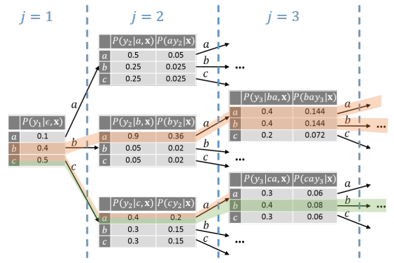

# The Search Problem in NMT

NMT 要計算的  (translation probability) 需要給定 `x` 和 `y`，但實作中並不會知道 y，得出這個 y 可說是機器翻譯的最終目標

利用 source sentence `x` 來求出最接近的  的這個任務叫做 **decoding** 或是 **inference**

NMT decoding 有兩大重點:

1. Search space 隨著字典大小增加而指數成長
   * 例如當字典大小為 32000 時 
   * 要翻譯出 20 個字的時候，就需要在 32000^20 個可能性中搜尋 (大於宇宙中的原子 10^82)

2. NMT 模型犯錯是時常的事情，Search 越深反而會產生較差的翻譯
   * `On NMT search errors and model errors: Cat got your tongue?`

# Greedy and Beam Search

NMT 最常用的 decoding 演算法是 `greedy search` 和 `beam search`

翻譯永遠是從左到右，隨著評分  來進行翻譯，也就是說翻譯都是與時間同步的 (time-synchronous)

## Greedy Search (Green)

Greedy search 會在每一個 time step 選取最好的 (綠色線所示)

* j=1 時選取 `c`
* j=2 時選取 `a`
* j=3 時選取 `b`

Greedy search 的最大問題是 `garden-path problem` (`P. Koehn, Neural machine translation`)

若是在 j=1 選的 `c` 是錯誤的，那麼後面選擇的單字就會整組壞掉

## Beam Search (Orange)

Beam search 就是為了緩解 greedy search 的問題而出現的，每次會選取 `n` 個分數最好的 `translation prefix`

例如上圖就是以 n=2 下去找出最好的翻譯，被選到的 n 個當前最好的前綴句子稱為 `active hypotheses`

儘管 beam search 看起來已經解決了 greedy search 的缺點，但事實上依然存在 `garden-path problem` (`On NMT search errors and model errors: Cat got your tongue?`)

